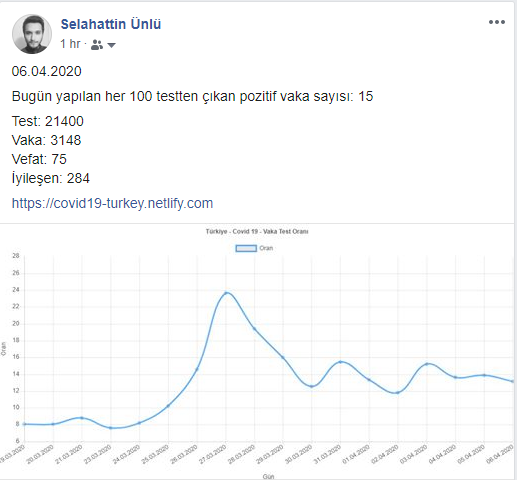

# Covid19 in Turkey

I wanted to visualize the data shared by the ministry of health.
So I thought we could get a better idea of the situation. So I created this simple website.

And then, I automated the things I do every day.

The script in "automation" directory does:

- Check if there is a new data in website of ministry of health
- Pull the data and put it into data.json file
- Build the javascript application
- Take a screenshot of the graphic
- Publish the updates to my Facebook Profile
- Commit the changes of data to Github

